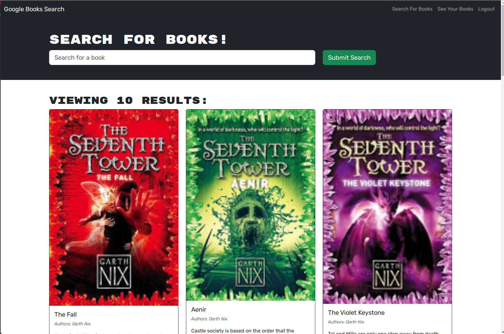
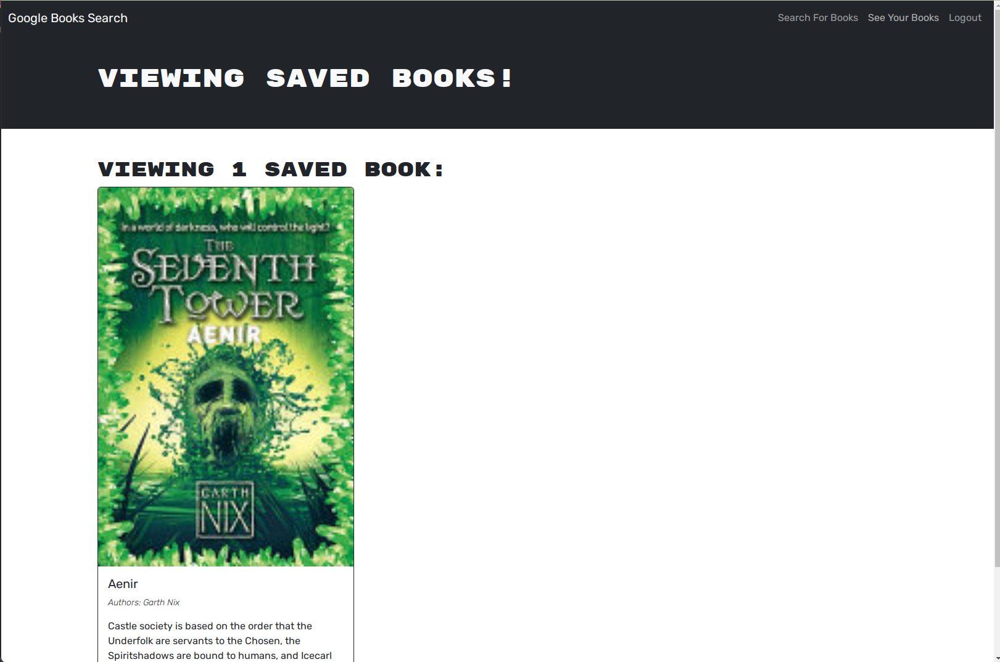

# book-search-evanK

## Table of Contents
- [Installation](#installation)
- [Usage](#usage)
- [Contributing](#contributing)
- [Contact](#contact)

## Description
This is an application that allows users to search for and save books to their profile. It was refactored to use apollo/graphql.

## Installation
To install the application on your own machine, clone the repository down and run npm install. This will install all necessary dependencies for all relevant directories.

## Usage
Application can be found at https://book-search-evank.onrender.com/. Once you sign up or log in, you can search for books and save them to your profile.

## Contributing
Starter code provided by the University of Denver.
Refactor performed by Evan Keller.

## Contact
If you have any questions or issues, please feel free to contact me at 33649ek@gmail.com.

